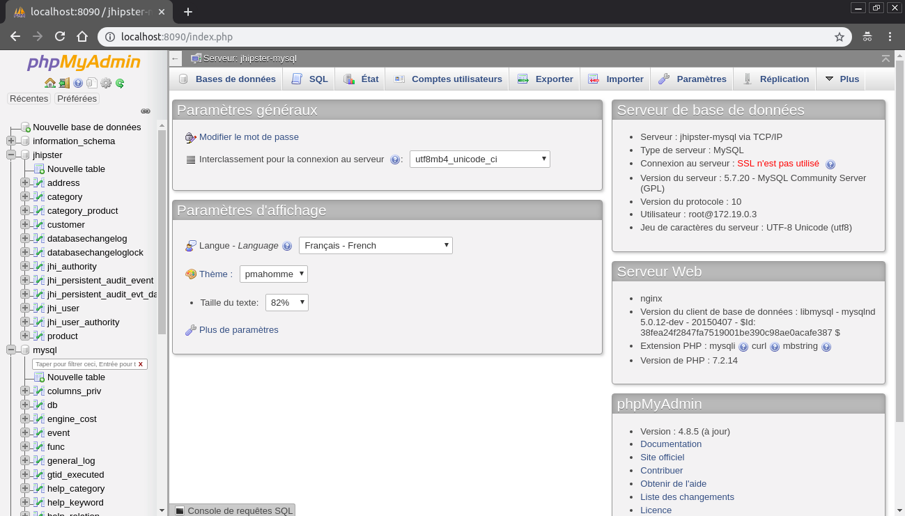

# generator-jhipster-administration-database
[![NPM version][npm-image]][npm-url] [![Build Status][travis-image]][travis-url] [![Dependency Status][daviddm-image]][daviddm-url]
> JHipster module, This module allows you to generate .yml files allowing you to administrate your production database (managing databases likephpmyadmin). For the moment the following databases are supported : MYSQL, POSTGRESQL, MONGODB, MARIADB.

# Introduction

This is a [JHipster](http://jhipster.github.io/) module, that is meant to be used in a JHipster application.
This module allows you to generate .yml files allowing you to administrate your production database (managing databases likephpmyadmin). For the moment the following databases are supported : MYSQL, POSTGRESQL, MONGODB, MARIADB. The result will be a phpmyadmin like application.



# Prerequisites

As this is a [JHipster](http://jhipster.github.io/) module, we expect you have JHipster and its related tools already installed:

- [Installing JHipster](https://jhipster.github.io/installation.html)
- [Installing Docker](https://docs.docker.com/install/)
- [Installing Docker-compose](https://docs.docker.com/compose/install/)

# Installation

## With Yarn

To install this module:

```bash
yarn global add generator-jhipster-administration-database
```

To update this module:

```bash
yarn global upgrade generator-jhipster-administration-database
```

## With NPM

To install this module:

```bash
npm install -g generator-jhipster-administration-database
```

To update this module:

```bash
npm update -g generator-jhipster-administration-database
```

# Usage

First, start the module:

```bash
yo jhipster-administration-database
```

Now a '<database-name>.yml' (for example: mysql.yml) file has been modified in the following folder : src/main/docker.

The service '<database-name>.yml' will start your database and the administration module. To start it:

```bash
sudo docker-compose -f <database-name>.yml up
```
If the database failed to start, you should check if the port is free (for example 'sudo service mysql stop' to stop the default mysql service).

You can now access to the administration service using the correct port.


## MYSQL

By default, we have choosen the port: 8090. To connect to the database: the username is 'root' and there is no password. You can change it in 'src/main/docker/mysql.yml'. You can find more information [here](https://github.com/phpmyadmin/docker).


## POSTGRESQL

By default, we have choosen the port: 3080. To connect to pgadmin: the username (mail address) is 'test@gmail.com' and the password is 'SUPER_SECRET_TO_CHANGE' (DO NOT forget to change it). To connect to the database the username is the name of your project (example: ProjectMYSQL) and there is no password. You can change it in 'src/main/docker/postgresql.yml'. You can find more information [here](https://hub.docker.com/r/dpage/pgadmin4).

## MONGODB

By default, we have choosen the port: 3000. To connect to the database, first clic on "connect" (top right corner). Then, choose your connection name and you have to put the connection url (you can find it in src/main/docker/mongodb.yml with the label MONGO_URL). Then save and you can connect to your database. You can change it in 'src/main/docker/postgresql.yml'. You can find more information [here](https://hub.docker.com/r/mongoclient/mongoclient/).

## MARIADB

By default, we have choosen the port: 8090. To connect to the database: the username is 'root' and there is no password. You can change it in 'src/main/docker/mariadb.yml'. You can find more information [here](https://github.com/phpmyadmin/docker).

# License

MIT © [Contribution Jhipster UGA](https://github.com/contribution-jhipster-uga)
Julien Courtial, Hugo Gros-Daillon, Cédric Lafrasse, Bastien Terrier

Copyright © (phpmyadmin)

Permission is hereby granted, free of charge, to any person obtaining a copy of this software and associated documentation files (the "Software"), to deal in the Software without restriction, including without limitation the rights to use, copy, modify, merge, publish, distribute, sublicense, and/or sell copies of the Software, and to permit persons to whom the Software is furnished to do so, subject to the following conditions:

The above copyright notice and this permission notice shall be included in all copies or substantial portions of the Software.

THE SOFTWARE IS PROVIDED "AS IS", WITHOUT WARRANTY OF ANY KIND, EXPRESS OR IMPLIED, INCLUDING BUT NOT LIMITED TO THE WARRANTIES OF MERCHANTABILITY, FITNESS FOR A PARTICULAR PURPOSE AND NONINFRINGEMENT. IN NO EVENT SHALL THE AUTHORS OR COPYRIGHT HOLDERS BE LIABLE FOR ANY CLAIM, DAMAGES OR OTHER LIABILITY, WHETHER IN AN ACTION OF CONTRACT, TORT OR OTHERWISE, ARISING FROM, OUT OF OR IN CONNECTION WITH THE SOFTWARE OR THE USE OR OTHER DEALINGS IN THE SOFTWARE.

[npm-image]: https://img.shields.io/npm/v/generator-jhipster-administration-database.svg
[npm-url]: https://npmjs.org/package/generator-jhipster-administration-database
[travis-image]: https://travis-ci.org/contribution-jhipster-uga/generator-jhipster-administration-database.svg?branch=master
[travis-url]: https://travis-ci.org/contribution-jhipster-uga/generator-jhipster-administration-database
[daviddm-image]: https://david-dm.org/contribution-jhipster-uga/generator-jhipster-administration-database.svg?theme=shields.io
[daviddm-url]: https://david-dm.org/contribution-jhipster-uga/generator-jhipster-administration-database
